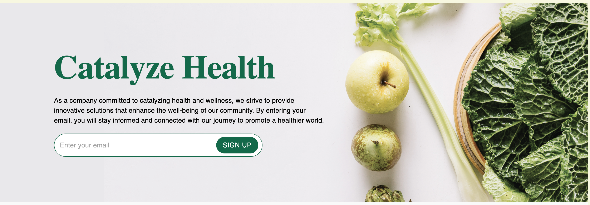
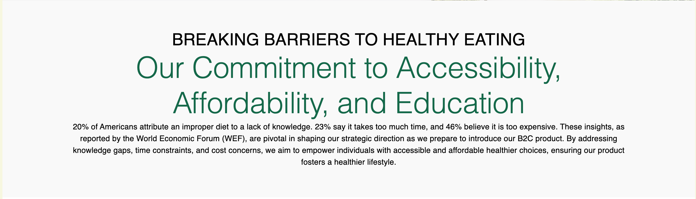
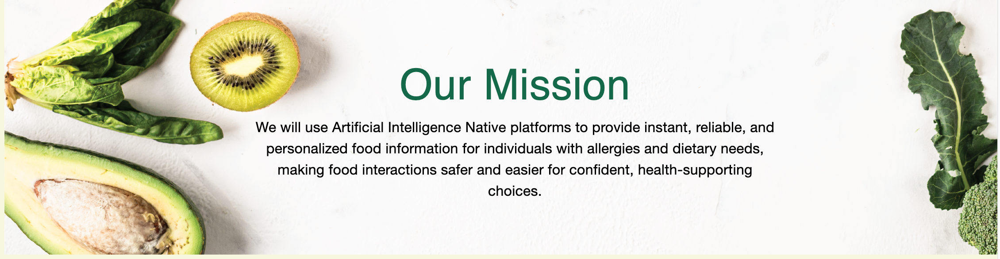
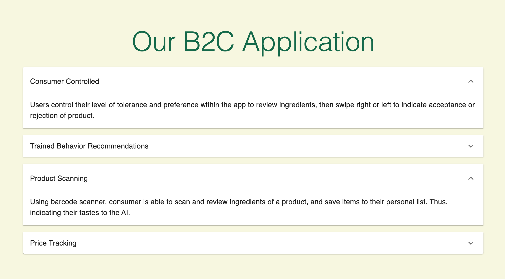
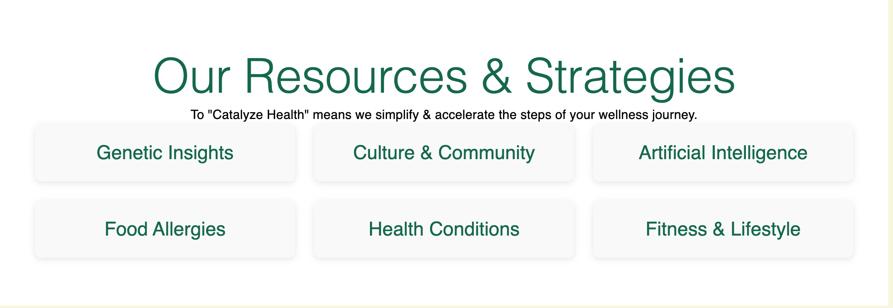
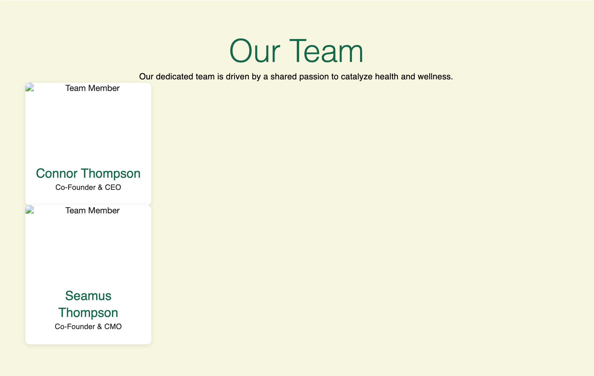
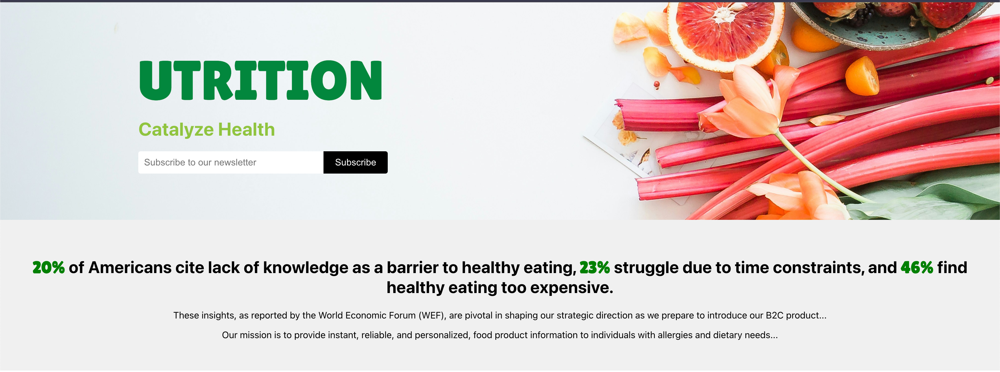
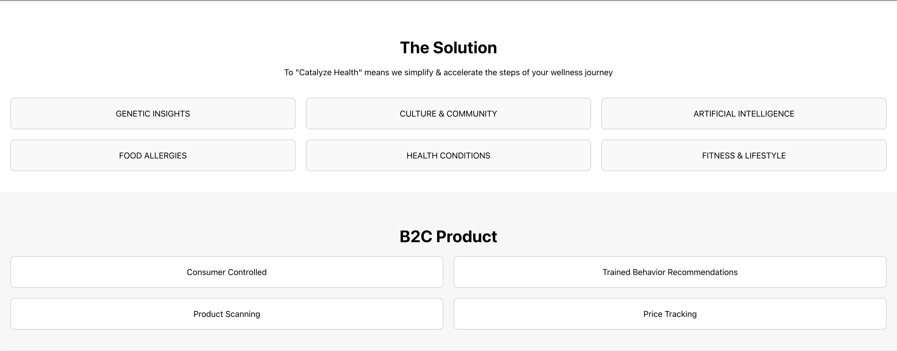

# UTrition Website v2.0

## 07.15.2024 Changes
I've updated the website format and content to reflect Sydney's new design. So far, I've had the chance to update the hero section to reflect the new design, but do not have access to the fonts chosen so far. I will update this section once I have the fonts.

The rest of the changes are in progress to achieve the final product, but the layout is taking shape. Below are the screenshots of the current implementation:
### Commitment Section

### Mission Section

### B2C Section

### Resources & Strategies Section

### Team Section

## 07.11.2024 Changes
I started by attempting to repliace the basic layout of Sydney's mockup, and added some styling to get close to what we wanted since I don't have details like fonts, stock images, etc. I also made it responsive to mobile.

Here's a screenshot of what I ended up with for the hero statistics sections:

### Unstyled Sections
The basic layout for the rest of the site is essentially implemented, but the styling and content is yet to come. Here's a few screenshots of what I have so far:

#### Solution + B2C Sections

#### Team + Footer

